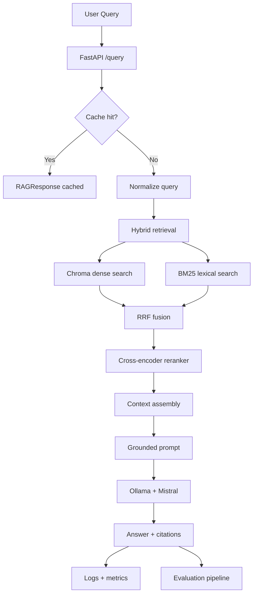

# MindStack

<p align="left">
   
   
   
   
   
</p>

Production-grade Retrieval-Augmented Generation for domain-specific document Q&A.

MindStack turns scattered internal documents into a grounded answer system. It combines hybrid retrieval, reranking, strict refusal behavior, citations, logging, metrics, and Dockerized deployment. The result is simple to demo, practical to run, and credible to present in interviews or on LinkedIn.

## What It Solves

Most RAG demos fail in the same ways: weak retrieval, no citations, no observability, and confident answers that are wrong. MindStack solves that with evidence-only responses, explicit refusals when context is missing, and an evaluation loop that checks quality before promotion. That makes it useful for support, onboarding, policy lookup, and knowledge-base search.

## Architecture



## Frontend Dashboard

<a href="https://ibb.co.com/LDKXK1Js"></a>

## Tech Stack

| Component | Technology | Why it Matters |
|---|---|---|
| API layer | FastAPI | Clean request validation, health checks, and production-friendly endpoint design |
| Response models | Pydantic v2 | Strong schema contracts for query and response payloads |
| Dense retrieval | ChromaDB + Sentence Transformers | Semantic search over ingested content |
| Sparse retrieval | BM25 | Exact-term recall for policy, support, and document-style queries |
| Fusion | Reciprocal Rank Fusion | Balances lexical and semantic retrieval without overfitting to one signal |
| Reranking | Cross-encoder reranker | Improves top-k precision before generation |
| LLM | Ollama + Mistral | Local inference with no external API dependency |
| Deployment | Docker Compose | Reproducible local environment and easy demo setup |
| Frontend | React + Vite + Tailwind CSS | Responsive, modern, portfolio-ready UI |
| Evaluation | Dataset-driven evaluator + quality gate | Enforces per-category pass rates and refusal-accuracy threshold |
| Observability | JSONL logs + `/metrics` | Query-level tracing and runtime visibility |

## Core Features

- **Grounded answers only**: The system answers from retrieved evidence and refuses when context is insufficient.
- **Hybrid retrieval**: Dense search and BM25 work together for better recall.
- **Reranked context**: A cross-encoder refines the strongest chunks before generation.
- **Operational visibility**: Logs, health checks, and metrics make the system easy to monitor.
- **Quality gate**: Evaluation results can block promotion when grounding drops below target.
- **Fast repeat queries**: In-memory caching and query normalization reduce latency.
- **Better demo UX**: The React frontend shows citations, cache state, metrics, and follow-up prompts clearly.

## Project Structure

```text
rag-system/
├─ src/                     # Backend API, retrieval, ingestion, models, DB metrics
├─ frontend/                # React + Vite UI
│  ├─ src/                  # App UI and styles
│  └─ package.json          # Frontend scripts and dependencies
├─ evals/                   # Evaluation dataset, runner, thresholds, results
├─ tests/                   # Unit and integration tests
├─ data/                    # Source documents + metrics DB
├─ chroma_db/               # Persistent vector store artifacts
├─ prompts/                 # Prompt configuration (rag_system_prompt.yaml)
├─ docker-compose.yml       # Ollama + backend services
└─ run-*.ps1                # Utility scripts (eval, ingestion, health checks)
```

### Important Root Scripts

| Script | Purpose |
|---|---|
| `run-ingestion.ps1` | Rebuilds chunks/embeddings and BM25 index inside backend container |
| `run-eval.ps1` | Runs eval dataset against current retrieval/generation pipeline |
| `check-health.ps1` | Checks Docker state + backend health + metrics endpoint |
| `test_comprehensive.py` | End-to-end backend sanity test run |

## API Reference

### `POST /query`

Submit a question to the RAG pipeline.

Important flags:

- `top_k_retrieval`: How many chunks to fetch before reranking.
- `top_k_rerank`: How many top chunks to keep for context.

Request:

```json
{
   "query": "What is the refund policy?",
   "top_k_retrieval": 6,
   "top_k_rerank": 2
}
```

Response:

```json
{
   "query": "What is the refund policy?",
   "answer": "Customers may return products within 30 days of purchase for a full refund.",
   "answer_grounded": true,
   "citations": [
      {
         "text": "Company Refund Policy: Customers may return products within 30 days of purchase for a full refund.",
         "source": "refund_policy.txt",
         "chunk_index": 1,
         "reranker_score": 5.25,
         "retrieval_method": "hybrid"
      }
   ],
   "chunks_retrieved": 3,
   "latency_ms": 44.5,
   "model_used": "extractive-fast-path",
   "prompt_version": "1.1",
   "reranker_applied": true,
   "llm_called": false,
   "cached": false,
   "timestamp": "2026-04-03T14:21:58.241805"
}
```

### `POST /ingest`

Rebuilds the document index from files in `data/`.

```bash
curl -X POST http://localhost:8000/ingest
```

### `POST /upload`

Uploads one or more documents and triggers reindex.

Supported file types: `.pdf`, `.txt`, `.md`, `.doc`, `.docx`

```bash
curl -X POST http://localhost:8000/upload -F "files=@data/refund_policy.txt"
```

### `GET /metrics`

Returns operational metrics derived from query logs.

```json
{
   "total_queries": 148,
   "grounded_rate": 0.96,
   "avg_latency_ms": 612.4,
    "p95_latency_ms": 1840.7,
    "p50_latency_ms": 420.2,
    "queries_last_24h": 148,
    "grounded_rate_7d": 0.95
}
```

### `GET /metrics/trend`

Returns daily trend points (grounded rate and average latency).

```json
[
   {
      "date": "2026-04-03",
      "total_queries": 74,
      "grounded_rate": 0.878,
      "avg_latency_ms": 445.6
   }
]
```

### `GET /health`

Returns service health for orchestration and checks.

```json
{
   "status": "ok"
}
```

## Performance & Evaluation

Latest verified run (2026-04-03) after reindex + evaluation rerun.

### Runtime Metrics

| Metric | Latest | Notes |
|---|---:|---|
| Average latency | 445.6 ms | From live `/metrics` endpoint |
| p95 latency | 58.7 ms | Current percentile output from `/metrics` |
| p50 latency | 12.3 ms | Median query latency |
| Grounded rate | 87.84% | Responses supported by retrieved evidence |
| Queries (24h) | 74 | Queries observed over last 24 hours |

### Evaluation Metrics

| Metric | Latest | Threshold |
|---|---:|---:|
| Overall pass rate | 74.00% (37/50) | project-defined |
| Grounded pass rate | 100.00% (20/20) | project-defined |
| Adversarial pass rate | 80.00% (8/10) | project-defined |
| Edge cases pass rate | 100.00% (5/5) | project-defined |
| Refusal accuracy | 26.67% (4/15) | >= 90% |

### Evaluation Results

| Run Date | Dataset Size | Pass/Fail | Notes |
|---|---:|---|---|
| 2026-04-03 18:55:37Z | 50 QA pairs | Fail | Quality gate failed on refusal accuracy threshold |

## How to Run Locally

### Option 1: Docker demo

```bash
cd h:\Projects\RAG_App_01\rag-system
docker compose up -d
```

Then open:

- API health: http://localhost:8000/health
- Frontend: start separately with Vite dev server

### Option 2: Run frontend separately

```bash
cd frontend
npm install
npm run dev
```

Default frontend URL is `http://localhost:3000`.
If port 3000 is occupied, run with an explicit port:

```bash
npm run dev -- --host 0.0.0.0 --port 5173
```

### Quick checks

```bash
curl http://localhost:8000/health
curl -X POST http://localhost:8000/query -H "Content-Type: application/json" -d "{\"query\":\"What is the refund policy?\"}"
```

### Rebuild the index

```bash
curl -X POST http://localhost:8000/ingest
```

### Run evaluation

```bash
cd h:\Projects\RAG_App_01\rag-system
.\run-eval.ps1
```

## Data and Runtime Artifacts

- `data/*.txt`: primary source documents used by ingestion.
- `data/uploads/`: user-uploaded files accepted by `/upload` endpoint.
- `data/metrics.db`: SQLite metrics store used by `/metrics` and `/metrics/trend`.
- `chroma_db/` + `bm25_index.pkl`: retrieval artifacts rebuilt by ingestion.
- `evals/results/latest.json`: latest evaluation output snapshot.

## CI/CD and Production Readiness

- Reproducible Docker builds keep the environment stable.
- Health and metrics endpoints make deployment checks straightforward.
- Query logging and evaluation results provide measurable quality control.
- The frontend and backend communicate through explicit API contracts.
- The system is designed to fail safely with refusal behavior instead of hallucination.

## Why This Is Real-World Ready

MindStack is built for correctness, not just conversation. It retrieves evidence before answering, cites what it used, and refuses when the context is weak. It also exposes metrics, logs, and evaluation results so quality can be inspected over time. That is the difference between a demo and a system you can actually trust for internal documentation, support workflows, and policy lookup.

## Future Vision / Next Steps

- Add document-level access control and per-user retrieval scopes.
- Store evaluation history in a dashboard with trend charts.
- Add exportable citations and shareable answer links.
- Support multiple knowledge bases and tenant-aware routing.
- Add streaming answers and richer follow-up question handling.
- Package a one-command demo profile for portfolio reviewers.

## Optional Extras

- Add more documents to `data/` and rerun ingestion to expand coverage.
- Update the evaluation dataset to match your own domain language.
- Tune `OLLAMA_MODEL`, `OLLAMA_NUM_PREDICT`, and retrieval settings for your hardware.
- Extend the React UI with richer charts, exports, or annotations.

## Contributing / Testing

- Use the Docker workflow to keep the environment reproducible.
- Validate changes with a real query, a repeat query, and the evaluation script.
- Keep UI changes aligned with the existing enterprise-style layout.
- Do not change the API contract unless the backend and frontend are updated together.
