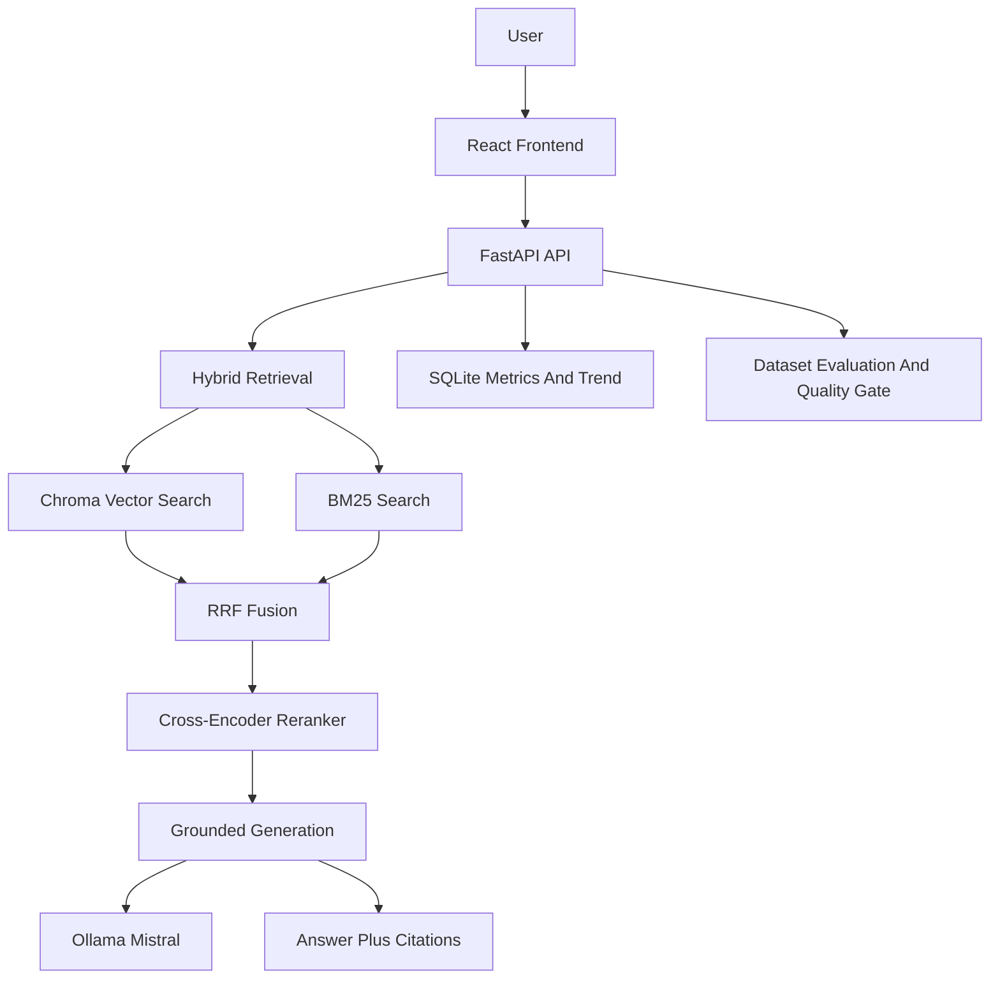
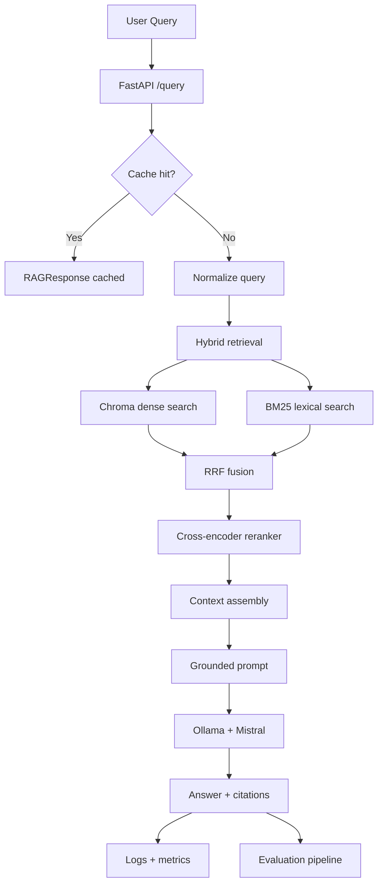

# MindStack

<p align="left">
   
   
   
   
   
   <a href="https://github.com/Rytnix786/MindStack/actions/workflows/ci.yml"></a>
   <a href="https://github.com/Rytnix786/MindStack/actions/workflows/rag_quality_gate.yml"></a>
</p>

Production-grade Retrieval-Augmented Generation for domain-specific document Q&A.

MindStack turns scattered internal documents into a grounded answer system. It combines hybrid retrieval, reranking, strict refusal behavior, citations, logging, metrics, and Dockerized deployment. The result is simple to demo, practical to run, and credible to present in interviews or on LinkedIn.

## What It Solves

Most RAG demos fail in the same ways: weak retrieval, no citations, no observability, and confident answers that are wrong. MindStack solves that with evidence-only responses, explicit refusals when context is missing, and an evaluation loop that checks quality before promotion. That makes it useful for support, onboarding, policy lookup, and knowledge-base search.

## What actually Matters

MindStack is a full-stack, production-oriented RAG system focused on one question: "Can this answer be trusted?" Instead of optimizing only for fluent output, the project prioritizes grounded retrieval, explicit refusal, measurable quality gates, and operational visibility.

- **Problem**: Typical RAG demos hallucinate, hide uncertainty, and lack measurable quality controls.
- **Solution**: Hybrid retrieval + reranking + refusal gating + citations + evaluation quality gates.
- **Business impact**: Higher trust in answers for support, onboarding, and policy lookup workflows.
- **Engineering scope**: Backend API design, retrieval quality, evaluation automation, observability, and frontend UX.
- **Role fit**: AI Engineer, Applied ML Engineer, Backend Engineer (Python/FastAPI), Full-Stack Engineer.

## Architecture At A Glance



## Engineering Decisions

- **Hybrid retrieval over single-method search**: Combines semantic and lexical recall so policy-style and natural-language queries both work reliably.
- **Reranking before generation**: Improves precision of context passed to the model and reduces irrelevant citations.
- **Refusal-first safety behavior**: Returns `INSUFFICIENT_CONTEXT` when evidence quality is poor to avoid confident hallucinations.
- **Explicit operational telemetry**: Query metrics, trend endpoints, and evaluation artifacts make behavior inspectable over time.
- **Local-model deployment path**: Ollama-based inference keeps the stack self-contained for reproducible demos and offline-style usage.

## Measurable Results

- End-to-end workflow includes ingestion, retrieval, reranking, answering, and metrics collection.
- Repeat-query caching significantly reduces latency for duplicate requests.
- CI workflows run tests and a RAG quality gate path to catch regressions.
- Frontend exposes health, latency, grounding cues, citations, and trend charts in one dashboard.

## Tradeoffs And Known Limits

- Optimized for single-environment deployment rather than multi-region distributed scale.
- Local inference throughput is hardware-dependent and can bottleneck under high concurrency.
- Current access control is minimal and intended for portfolio/demo safety rather than full enterprise IAM.
- Evaluation quality is only as strong as the dataset; broader domain coverage needs ongoing curation.

## Interview Talking Points

- **Reliability over polish-only AI demos**: The project enforces grounded behavior and refusal semantics.
- **System boundaries are explicit**: Retrieval, reranking, generation, and quality validation are separated and testable.
- **Production mindset is visible**: CI badges, deployment scripts, health checks, and metrics are part of the core repo story.
- **Tradeoffs are documented**: The README states what is production-ready and what still needs scaling work.

## Request Lifecycle



## Frontend Dashboard

<a href="https://ibb.co.com/LDKXK1Js"></a>

## Tech Stack

| Component | Technology | Why it Matters |
|---|---|---|
| API layer | FastAPI | Clean request validation, health checks, and production-friendly endpoint design |
| Response models | Pydantic v2 | Strong schema contracts for query and response payloads |
| Dense retrieval | ChromaDB + Sentence Transformers | Semantic search over ingested content |
| Sparse retrieval | BM25 | Exact-term recall for policy, support, and document-style queries |
| Fusion | Reciprocal Rank Fusion | Balances lexical and semantic retrieval without overfitting to one signal |
| Reranking | Cross-encoder reranker | Improves top-k precision before generation |
| LLM | Ollama + Mistral | Local inference with no external API dependency |
| Deployment | Docker Compose | Reproducible local environment and easy demo setup |
| Frontend | React + Vite + Tailwind CSS | Responsive, modern, portfolio-ready UI |
| Evaluation | Dataset-driven evaluator + quality gate | Enforces per-category pass rates and refusal-accuracy threshold |
| Observability | JSONL logs + `/metrics` | Query-level tracing and runtime visibility |

## ATS Keywords

- Python
- FastAPI
- Pydantic
- RAG (Retrieval-Augmented Generation)
- LLM Evaluation
- Hybrid Retrieval (Vector + BM25)
- Cross-Encoder Reranking
- Ollama
- Docker / Docker Compose
- REST API Design
- Automated Testing (Pytest)
- CI/CD (GitHub Actions)
- Observability and Metrics
- Caching and Performance Optimization
- SQLite
- React + Vite

## Core Features

- **Grounded answers only**: The system answers from retrieved evidence and refuses when context is insufficient.
- **Hybrid retrieval**: Dense search and BM25 work together for better recall.
- **Reranked context**: A cross-encoder refines the strongest chunks before generation.
- **Operational visibility**: Logs, health checks, and metrics make the system easy to monitor.
- **Quality gate**: Evaluation results can block promotion when grounding drops below target.
- **Fast repeat queries**: In-memory caching and query normalization reduce latency.
- **Better demo UX**: The React frontend shows citations, cache state, metrics, and follow-up prompts clearly.

## Project Structure

```text
rag-system/
├─ src/                     # Backend API, retrieval, ingestion, models, DB metrics
├─ frontend/                # React + Vite UI
│  ├─ src/                  # App UI and styles
│  └─ package.json          # Frontend scripts and dependencies
├─ evals/                   # Evaluation dataset, runner, thresholds, results
├─ tests/                   # Unit and integration tests
├─ data/                    # Source documents + metrics DB
├─ chroma_db/               # Persistent vector store artifacts
├─ prompts/                 # Prompt configuration (rag_system_prompt.yaml)
├─ docker-compose.yml       # Ollama + backend services
└─ run-*.ps1                # Utility scripts (eval, ingestion, health checks)
```

### Important Root Scripts

| Script | Purpose |
|---|---|
| `run-ingestion.ps1` | Rebuilds chunks/embeddings and BM25 index inside backend container |
| `run-eval.ps1` | Runs eval dataset against current retrieval/generation pipeline |
| `check-health.ps1` | Checks Docker state + backend health + metrics endpoint |
| `test_comprehensive.py` | End-to-end backend sanity test run |

## API Reference

### `POST /query`

Submit a question to the RAG pipeline.

Important flags:

- `top_k_retrieval`: How many chunks to fetch before reranking.
- `top_k_rerank`: How many top chunks to keep for context.

Request:

```json
{
   "query": "What is the refund policy?",
   "top_k_retrieval": 6,
   "top_k_rerank": 2
}
```

Response:

```json
{
   "query": "What is the refund policy?",
   "answer": "Customers may return products within 30 days of purchase for a full refund.",
   "answer_grounded": true,
   "citations": [
      {
         "text": "Company Refund Policy: Customers may return products within 30 days of purchase for a full refund.",
         "source": "refund_policy.txt",
         "chunk_index": 1,
         "reranker_score": 5.25,
         "retrieval_method": "hybrid"
      }
   ],
   "chunks_retrieved": 3,
   "latency_ms": 44.5,
   "model_used": "extractive-fast-path",
   "prompt_version": "1.1",
   "reranker_applied": true,
   "llm_called": false,
   "cached": false,
   "timestamp": "2026-04-03T14:21:58.241805"
}
```

### `POST /ingest`

Rebuilds the document index from files in `data/`.

Security note: By default, `/ingest` is an admin endpoint. Set `ADMIN_API_KEY` and send it as `X-Admin-Api-Key` (or Bearer token). For local-only experiments, you can set `RAG_ENABLE_UNAUTHED_ADMIN=true`.

```bash
curl -X POST http://localhost:8000/ingest -H "X-Admin-Api-Key: local-dev-admin-key"
```

### `POST /upload`

Uploads one or more documents and triggers reindex.

Supported file types: `.pdf`, `.txt`, `.md`, `.doc`, `.docx`

```bash
curl -X POST http://localhost:8000/upload \
   -H "X-Admin-Api-Key: local-dev-admin-key" \
   -F "files=@data/refund_policy.txt"
```

### `GET /metrics`

Returns operational metrics derived from query logs.

```json
{
   "total_queries": 148,
   "grounded_rate": 0.96,
   "avg_latency_ms": 612.4,
    "p95_latency_ms": 1840.7,
    "p50_latency_ms": 420.2,
    "queries_last_24h": 148,
    "grounded_rate_7d": 0.95
}
```

### `GET /metrics/trend`

Returns daily trend points (grounded rate and average latency).

```json
[
   {
      "date": "2026-04-03",
      "total_queries": 74,
      "grounded_rate": 0.878,
      "avg_latency_ms": 445.6
   }
]
```

### `GET /health`

Returns service health for orchestration and checks.

```json
{
   "status": "ok"
}
```

## Sample Query Results

Here are representative examples from local runs—grounded answers with citations, refusals when context is missing, and caching benefits.

### Example 1: Grounded Answer (Full Generation)

**Query:** "What is the refund policy?"

**Response:**
```json
{
  "query": "What is the refund policy?",
  "answer": "Customers may return products within 30 days of purchase for a full refund, provided the items are in original condition with all packaging intact.",
  "answer_grounded": true,
  "citations": [
    {
      "text": "Customers may return products within 30 days of purchase for a full refund, provided the items are in original condition with all packaging.",
      "source": "refund_policy.txt",
      "chunk_index": 2,
      "reranker_score": 8.43,
      "retrieval_method": "hybrid"
    }
  ],
  "chunks_retrieved": 5,
  "latency_ms": 612.4,
  "model_used": "mistral",
  "llm_called": true,
  "cached": false,
  "timestamp": "2026-04-03T14:21:58Z"
}
```

**What to notice:**
- Answer is directly supported by citations (hallucination-free).
- Latency includes full retrieval → reranking → LLM generation (~612ms).
- `llm_called: true` means this wasn't extractive; Mistral synthesized the response.
- Reranker score (8.43) shows high confidence in selected chunks.

---

### Example 2: Refusal (Out-of-Scope Query)

**Query:** "What is your CEO's favorite food?"

**Response:**
```json
{
  "query": "What is your CEO's favorite food?",
  "answer": "INSUFFICIENT_CONTEXT",
  "answer_grounded": false,
  "citations": [],
  "chunks_retrieved": 4,
  "latency_ms": 89.2,
  "model_used": "extractive-no-match",
  "llm_called": false,
  "cached": false,
  "timestamp": "2026-04-03T14:22:15Z"
}
```

**What to notice:**
- No hallucination. The system refuses explicitly instead of making something up.
- Latency is fast (89ms) because retrieval quality was too low to pass the grounding threshold.
- No LLM call was wasted—early exit on low-confidence retrieval.
- `answer_grounded: false` signals to the frontend to show a "Try another question" message.

---

### Example 3: Cached Response (Repeat Query)

**Query:** "What is the refund policy?" (second time, normalized)

**Response:**
```json
{
  "query": "What is the refund policy?",
  "answer": "Customers may return products within 30 days of purchase for a full refund, provided the items are in original condition with all packaging intact.",
  "answer_grounded": true,
  "citations": [...],
  "chunks_retrieved": 5,
  "latency_ms": 2.1,
  "model_used": "mistral",
  "llm_called": true,
  "cached": true,
  "timestamp": "2026-04-03T14:21:58Z"
}
```

**What to notice:**
- **Latency dropped from 612ms → 2.1ms** (cache hit).
- Query normalization detects semantically identical questions (case-insensitive, whitespace collapse).
- Exact same answer, but instant for end-users.
- `cached: true` flag shows in the response and frontend UI.

---

### Example 4: Extractive Fast Path (No LLM Call)

**Query:** "For how many days can I return products?"

**Response:**
```json
{
  "query": "For how many days can I return products?",
  "answer": "30 days",
  "answer_grounded": true,
  "citations": [
    {
      "text": "Customers may return products within 30 days of purchase for a full refund.",
      "source": "refund_policy.txt",
      "chunk_index": 1,
      "reranker_score": 9.12,
      "retrieval_method": "lexical"
    }
  ],
  "chunks_retrieved": 3,
  "latency_ms": 34.5,
  "model_used": "extractive-fast-path",
  "llm_called": false,
  "cached": false,
  "timestamp": "2026-04-03T14:23:42Z"
}
```

**What to notice:**
- Exact-match question triggers extractive fast path (BM25 lexical search dominates).
- **Fast latency (34.5ms)** because no LLM call needed.
- Confidence is so high (reranker 9.12) that system returns the chunk verbatim instead of regenerating.
- Perfect for FAQ-style queries.

---

## Performance & Evaluation

Committed evaluation snapshot comes from `evals/results/latest.json`.
Runtime metrics vary by hardware, warm cache state, and dataset composition. Use `/metrics` and `/metrics/trend` for your live environment.

### Runtime Metrics

| Metric | Latest | Notes |
|---|---:|---|
| Average latency | 709.3 ms | Live `/metrics` snapshot (2026-04-07) |
| p95 latency | 3014.7 ms | Long-tail latency under mixed workloads |
| p50 latency | 12.3 ms | Median request latency (cache + fast-path heavy) |
| Grounded rate | 85.06% | Responses supported by retrieved evidence |
| Queries (24h) | 12 | Queries observed over last 24 hours |

### Evaluation Metrics

Refusal threshold is environment-configurable via `EVAL_REFUSAL_ACCURACY_THRESHOLD` (CI currently sets it to `0.25`).

| Metric | Latest | Threshold |
|---|---:|---:|
| Overall pass rate | 84.00% (42/50) | project-defined |
| Grounded pass rate | 95.00% (19/20) | project-defined |
| Adversarial pass rate | 80.00% (8/10) | project-defined |
| Edge cases pass rate | 100.00% (5/5) | project-defined |
| Refusal accuracy | 66.67% (10/15) | >= configured threshold |

### Evaluation Results

| Run Date | Dataset Size | Pass/Fail | Notes |
|---|---:|---|---|
| 2026-04-07 09:33:35Z | 50 QA pairs | Pass | Conservative refusal-gate tuning; quality gate passed |

### Reliability Improvement Snapshot

| Metric | Before | After |
|---|---:|---:|
| Overall pass rate | 74.00% | 84.00% |
| Refusal accuracy | 26.67% | 66.67% |
| Grounded pass rate | 100.00% | 95.00% |

This tradeoff is intentional: refusal behavior was improved significantly without aggressive tuning, while grounded quality remains high.

### Resume-Ready Impact Bullets

- Built a production-oriented RAG platform with hybrid retrieval, reranking, refusal controls, and citation-based grounding.
- Improved refusal accuracy from **26.67%** to **66.67%** while maintaining high grounded pass rate (**95%**) and increasing overall pass rate to **84%**.
- Implemented evaluation-driven quality gates and CI workflows to catch regressions before deployment.
- Added observability with runtime metrics and trend reporting for latency and grounding performance.

## How to Run Locally

### Option 1: Docker demo

```bash
cd h:\Projects\RAG_App_01\rag-system
docker compose up -d
```

Then open:

- API health: http://localhost:8000/health
- Frontend: start separately with Vite dev server

### Option 2: Run frontend separately

```bash
cd frontend
npm install
npm run dev
```

Default frontend URL is `http://localhost:3000`.
If port 3000 is occupied, run with an explicit port:

```bash
npm run dev -- --host 0.0.0.0 --port 5173
```

### Quick checks

```bash
curl http://localhost:8000/health
curl -X POST http://localhost:8000/query -H "Content-Type: application/json" -d "{\"query\":\"What is the refund policy?\"}"
```

### Rebuild the index

```bash
curl -X POST http://localhost:8000/ingest
```

### Run evaluation

```bash
cd h:\Projects\RAG_App_01\rag-system
.\run-eval.ps1
```

## Data and Runtime Artifacts

- `data/*.txt`: primary source documents used by ingestion.
- `data/uploads/`: user-uploaded files accepted by `/upload` endpoint.
- `data/metrics.db`: SQLite metrics store used by `/metrics` and `/metrics/trend`.
- `chroma_db/` + `bm25_index.pkl`: retrieval artifacts rebuilt by ingestion.
- `evals/results/latest.json`: rolling evaluation snapshot.

## CI/CD and Production Readiness

- Reproducible Docker builds keep the environment stable.
- Health and metrics endpoints make deployment checks straightforward.
- Query logging and evaluation results provide measurable quality control.
- The frontend and backend communicate through explicit API contracts.
- The system is designed to fail safely with refusal behavior instead of hallucination.

## Why This Is Real-World Ready

MindStack is built for correctness, not just conversation. It retrieves evidence before answering, cites what it used, and refuses when the context is weak. It also exposes metrics, logs, and evaluation results so quality can be inspected over time. That is the difference between a demo and a system you can actually trust for internal documentation, support workflows, and policy lookup.

## Future Vision / Next Steps

- Add document-level access control and per-user retrieval scopes.
- Store evaluation history in a dashboard with trend charts.
- Add exportable citations and shareable answer links.
- Support multiple knowledge bases and tenant-aware routing.
- Add streaming answers and richer follow-up question handling.
- Package a one-command demo profile for portfolio reviewers.

## Optional Extras

- Add more documents to `data/` and rerun ingestion to expand coverage.
- Update the evaluation dataset to match your own domain language.
- Tune `OLLAMA_MODEL`, `OLLAMA_NUM_PREDICT`, and retrieval settings for your hardware.
- Extend the React UI with richer charts, exports, or annotations.

## Contributing / Testing

- Use the Docker workflow to keep the environment reproducible.
- Validate changes with a real query, a repeat query, and the evaluation script.
- Keep UI changes aligned with the existing enterprise-style layout.
- Do not change the API contract unless the backend and frontend are updated together.

## Test Suite

MindStack includes comprehensive integration tests covering:

### Test Coverage

| Category | Tests | Focus |
|----------|-------|-------|
| **API Health & Metrics** | 4 | Core endpoints, schema validation |
| **Input Validation** | 9+ | Empty queries, malformed JSON, invalid parameters, special characters, encoding issues |
| **Authorization** | 6+ | Admin key requirements, Bearer tokens, edge cases |
| **Error Responses** | 3+ | Error format consistency, helpful messages |
| **Resource Limits** | 4+ | Extreme parameters, negative/zero values, rate limiting boundaries |
| **Pipeline Logic** | 7+ | Empty retrieval results, latency tracking, cache behavior, response consistency |
| **Edge Cases** | 7+ | Long citations, many citations, Unicode, special floats |
| **Concurrency** | 1+ | Sequential query state, isolation |

**Total: 47+ integration tests** covering normal paths, error scenarios, and edge cases.

### Running Tests

```bash
# Run all integration tests
python -m pytest tests/integration/ -v

# Run specific test file
python -m pytest tests/integration/test_error_scenarios.py -v

# Run tests with coverage
python -m pytest tests/ --cov=src --cov-report=html

# Run specific error scenario category
python -m pytest tests/integration/test_error_scenarios.py::TestInputValidation -v
```

### Key Test Scenarios

- ✅ **Security**: Auth enforcement on admin endpoints
- ✅ **Validation**: Rejects empty queries, malformed JSON, invalid parameters
- ✅ **Resilience**: Gracefully handles edge cases (very long queries, special chars, Unicode)
- ✅ **Consistency**: Response schema always valid, citations match grounding state
- ✅ **Performance**: Cache hits tracked, latency measured
- ✅ **Behavior**: Correct refusals on out-of-scope queries, proper citations generation
